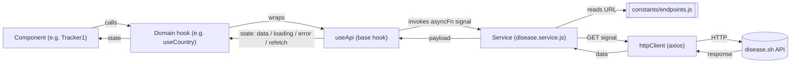
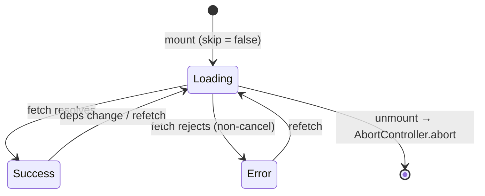

# Data Flow

How a request travels from a React component down to the public `disease.sh` API, and how the response makes its way back. This mirrors the rule documented in [CLAUDE.md §9](../CLAUDE.md): **endpoint constant → service → hook → component**.

---

## Architecture

---

## Notes

- **`useApi`** ([src/hooks/useApi.js](../src/hooks/useApi.js)) owns the loading / error state machine via `useReducer` and cancels in-flight requests with `AbortController` on unmount or dependency change.
- **Errors** are normalized through `parseApiError` ([src/utils/errors.js](../src/utils/errors.js)) so components render localized messages, never raw Axios errors.
- **Components never import `axios` or `httpClient` directly** — they consume domain hooks (`useCountry`, `useCountries`, `useGlobalTotals`, `useHistoricalData`).
- **Endpoints** are centralized in [src/constants/endpoints.js](../src/constants/endpoints.js); services build the URL from there and pass `{ signal }` through to Axios.
- **Refetch** is exposed by `useApi` and surfaced by every domain hook — used by `ErrorState` retry buttons.

---

## `useApi` state lifecycle

