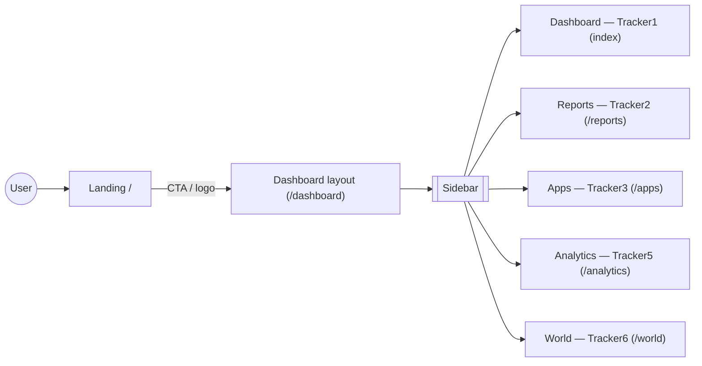
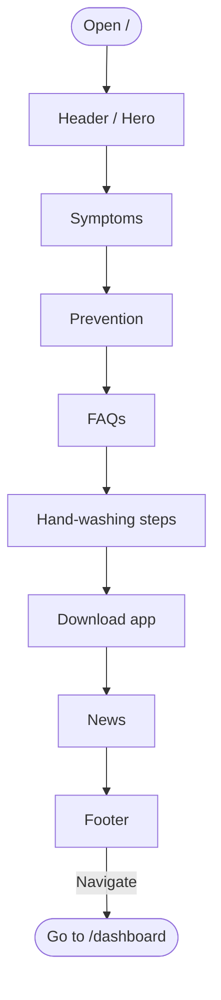
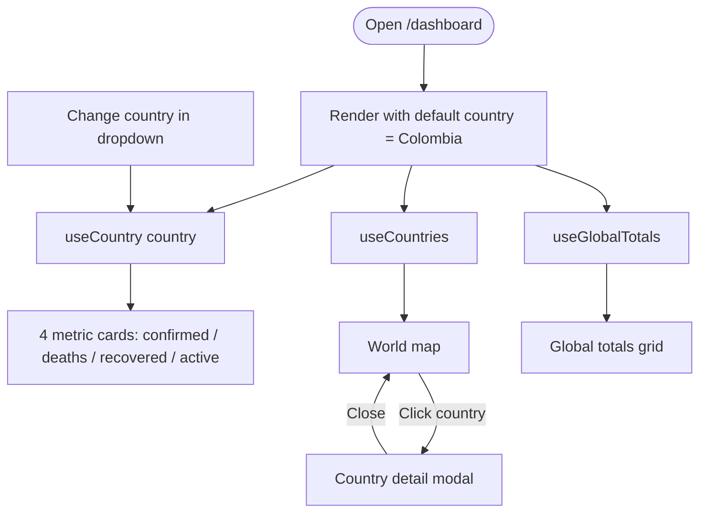
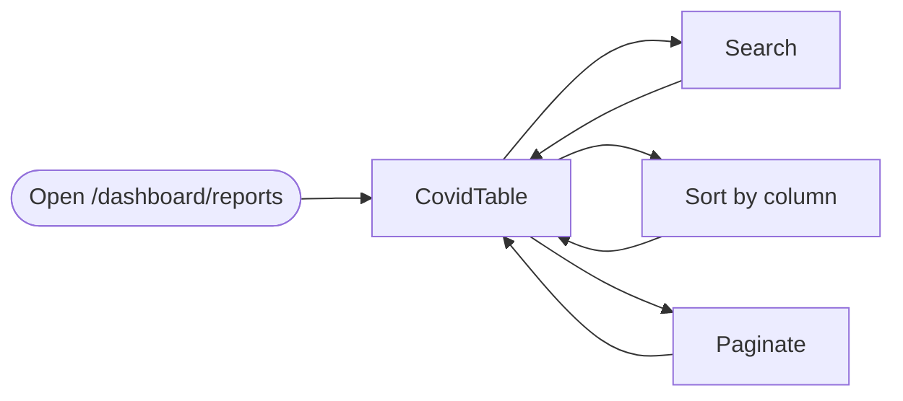
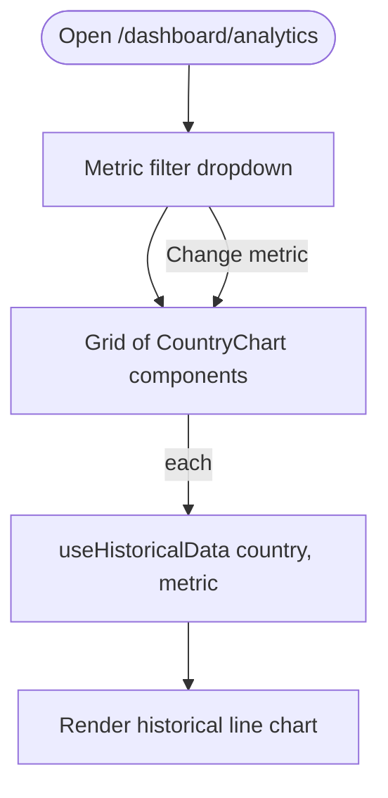
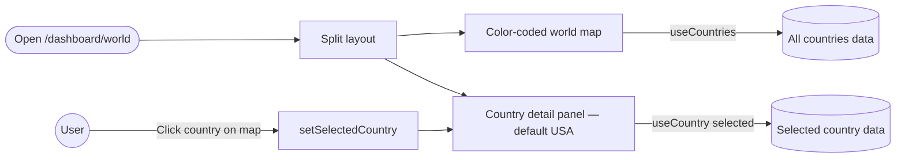

# User Flows

Five user-facing flows that cover the working surface of the app. Each diagram is meant to be explained in ~30 seconds.

> The routes `/dashboard/projects`, `/dashboard/files` and `/dashboard/messages` are placeholders (`UnderConstruction`) and are intentionally omitted from these diagrams.

---

## 1. App navigation overview

The app has a single entry point (`/`) and a dashboard shell (`/dashboard`) that hosts every tracker through nested routes. The Sidebar is the only navigation surface.

---

## 2. Landing page

The landing page is a one-page scroll composed of 8 sections. There is no fetching — content comes from `src/constants/landingData.js`. The user can keep scrolling or jump into the dashboard.

---

## 3. Dashboard — Tracker1

Default route of the dashboard. The user picks a country (defaults to Colombia), sees its 4 metric cards, can click any country on the world map to open a detail modal, and reads global totals at the bottom.

---

## 4. Reports — Tracker2

A paginated, searchable table of every country's COVID data. The user interacts only with the table widget.

---

## 5. Analytics — Tracker5

The user filters by metric (confirmed / deaths / recovered / active). One historical line chart is rendered per country in the fixed `COUNTRIES` list, all reacting to the same filter.

---

## 6. World — Tracker6

Split screen: a color-coded world map on the left (red intensity by case count) and a country detail panel on the right (USA by default). Clicking a country on the map updates the right panel.

